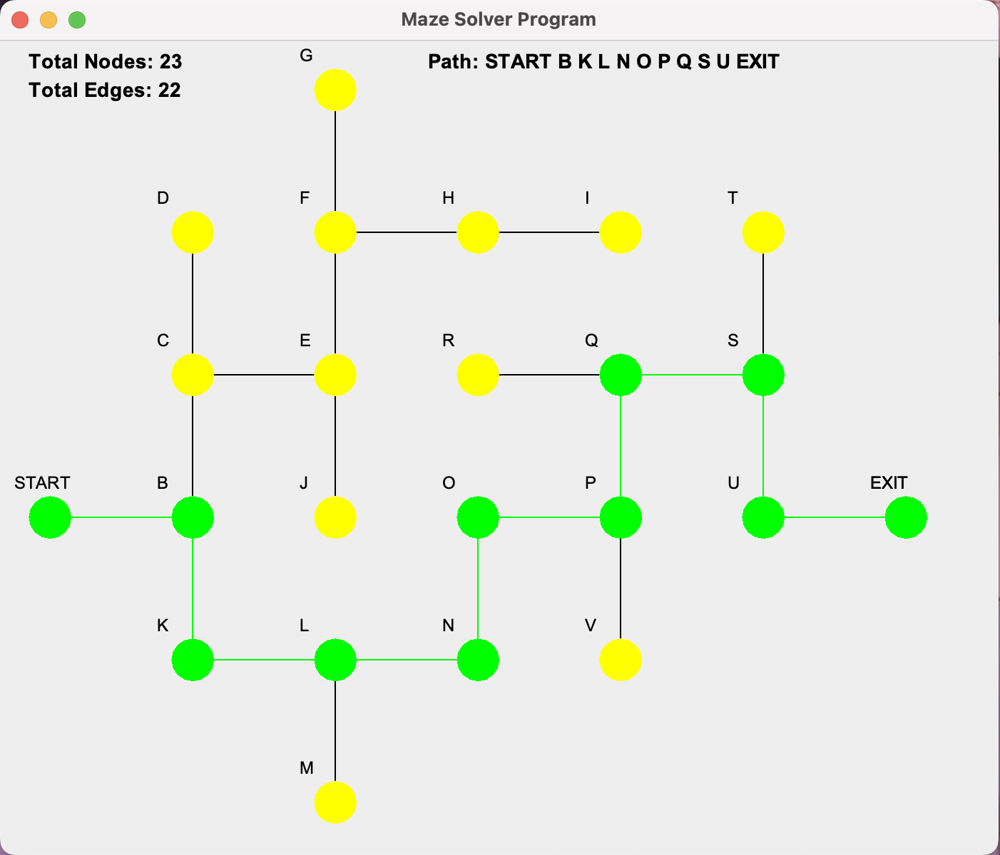

# Maze Solver

## Overview

This program loads maze configurations from text files, display the maze, and finds the path from the starting vertex to the exiting vertex. The program also animates the pathfinding process and the solution (correct path) is highlighted.

## Feature

- **Load Maze**: Reads maze configurations from text files.
- **Draw Maze**: Displays the on a panel with labeled nodes.
- **Pathfinding**: Finds and animates the path from the start vertex to exit.
- **Highlight Path**: Highlights the found path and displays it on the panel.
- Shows the nodes' names of the path in order from "Start" to "Exit"
- Works with different maze configurations with different txt files.


## Text File Format

The maze is defined in a text file with the following format:

- **Header**: Number of edges, Number of columns, Number of rows
- **Vertices**: Vertex's name, x position, y position, next linked vertex's name, next linked vertex's name ...

Example:
22,7,6
START,0,2,B,A
B,1,2,C,K
C,1,3,D,E
...
V,4,1,N,A
EXIT,6,2,A,A

Note: 
"A" is used to represent there is no next linked vertex (null).
"W" links to the exit.

## Usage

### Prerequisites

- Java Development Kit (JDK)

### Setup

Clone the repository
```bash
   git clone https://github.com/MinThiha22/maze-solver.git
   cd maze-solver
```
### Run program 

Run the JAR file:
```bash
   java -jar maze-solver.jar
```
## Example Output

Here’s an example of what the maze might look like once it’s loaded and solved:


## Implementation Details

The main algorithm used in this program is the Breadth-First Search (BFS) algorithm for finding the shortest path in an unweighted graph. Java Swing is used for GUI of the program.

## Example Output

Here’s an example of what the maze might look like once it’s loaded and solved:



## Contact

For any questions or suggestions, please open an issue on GitHub or contact yourname@example.com.